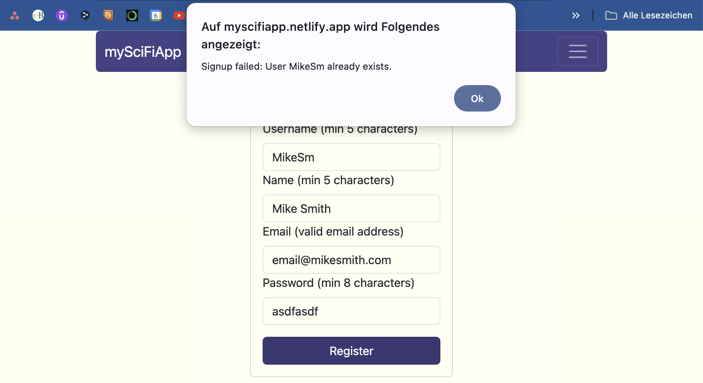

# A Movie App

<!-- toc -->

- [Description](#description)
- [Technologies](#technologies)
- [Setup](#setup)
  * [Hosted on Netlify](#hosted-on-netlify)
  * [Running the app locally](#running-the-app-locally)
- [Key Features](#key-features)
- [Impressions](#impressions)
  * [Login Screen](#login-screen)
  * [User Registration with Validation](#user-registration-with-validation)
  * [Failed SignUp Data from the Server](#failed-signup-data-from-the-server)
  * [Main View with Movie List](#main-view-with-movie-list)
  * [Search Bar](#search-bar)
  * [Single Movie View](#single-movie-view)
  * [User Profile and Favorite Movies](#user-profile-and-favorite-movies)
- [Conclusion](#conclusion)
- [User Experience](#user-experience)

<!-- tocstop -->

## Description
In this project, a client-side interface for the movie app "mySciFiApp" is built, complementing the previously developed [server-side](https://github.com/OtmarKirch/sci-fi-app). Utilizing the React library, several interface views are created to interact with the defined REST API endpoints. The project emphasizes the importance of code readability and maintainability, along with designing a user-friendly interface. By completing this Achievement, a full-stack web application using the MERN (MongoDB, Express, React, and Node.js) stack is developed, demonstrating comprehensive skills in full-stack JavaScript development.

## Technologies
- React
- HTML, CSS, JavaScript
- react bootstrap

## Setup

### Hosted on Netlify
The app is hosted at netlifly. Take a look at the [finished app here](https://myscifiapp.netlify.app/)

### Running the app locally
1. Clone the repository
2. Make sure Node.js and npm are installed and then run `npm install` in the project directory to install the dependencies
3. Run `parcel src/index.html` to start the development server
4. Open the browser and navigate to localhost with chosen port to view the app

## Key Features

### User Experience
The Sci-Fi App is a user-friendly platform designed for movie enthusiasts. It provides a streamlined experience for exploring and learning more about a wide array of movies.

Upon logging in, users are greeted with a clean, intuitive interface showcasing a collection of movies. Each movie is presented in a card format, displaying key information such as the title and a preview image. A simple click on a movie card reveals more detailed information about the movie, including its synopsis and director.

One of the key features of the app is the ability to curate a personal list of favorite movies. Users can easily add or remove movies from their favorites list, providing a personalized browsing experience. This feature makes it easy for users to keep track of the movies they love and want to revisit.

The app also includes a search function, allowing users to quickly find specific movies within the collection. This feature enhances the user experience by making the exploration of the movie collection more efficient and enjoyable.

### List of Features
- Returns ALL movies to the user (each movie item with an image, title, and description)
- Filtering the list of movies with a “search” feature
- Ability to select a movie for more details
- Ability to log out
- Ability to navigate to Profile view
- In single movie view returns description on the movie, the genre, the director and movie suggestions based on the genre and director
- Allows users to add a movie to their list of favorites
- Allows users to log in with a username and password
- Allows new users to register (username, password, email)
- Displays user registration details
- Allows users to update their info (username, password, email)
- Displays favorite movies
- Allows users to remove a movie from their list of favorites
- Allows existing users to deregister

## Impressions

### Login Screen
When entering the website, the user is shown the login screen. If the user is not registered, they can click on the "Sign Up" button to register.

### User Registration with Validation
In the registration form, the user can enter the details. A client-side validation is implemented to ensure that the user enters the correct data. If the user enters incorrect data, the form will display an error message with the language dependent on the browser settings.

### Failed SignUp Data from the Server
If the user enters data that is already in the database, the server will return an error message. The client will then display the problem to the user appropriately.

### Main View with Movie List
When logged in, the user is shown all movies in the database.

### Search Bar
The search bar allows the user to reduce the number of movies shown on the screen. The search term is matched against the movie title, genre and director.

### Single Movie View
When the user clicks on "Go to movie" on a movie card, a detailed view of the movie is shown. Here, the movie can be added and removed from the user's favorite list. There are also descriptions of the genre, the director and lists of movies with the same genre or director.

### User Profile and Favorite Movies
The user profile shows the user's details. Here, the user can update their details or deregister. At the bottom of the user profile, the user's favorite movies are shown.

## Conclusion

### Challenges
While learning React, I was challenged by the structure of the components and the state management. Initially, keeping track of the state and passing it down to the child components was a bit confusing. However, with practice, I was able to understand the concepts better and implement them effectively in the project. By now, I feel comfortable working with React and utilizing its features to build dynamic and interactive web applications. I wouldn't want to miss the component-based structure in future projects.

### Future Improvements
In the future, I would like to enhance the user experience by adding more features to the app. For example, I could implement a feature that allows users to rate movies and leave reviews. This would provide valuable feedback to other users and help them make informed decisions about which movies to watch. Additionally, I could integrate a recommendation system that suggests movies based on a user's viewing history and preferences. This would further personalize the user experience and make the app more engaging and interactive.

### Final Thoughts
Learning React was a rewarding experience. As a major block in the MERN stack, I feel confident in my ability to build full-stack web applications using React. The project allowed me to apply my knowledge of HTML, CSS, and JavaScript in a real-world scenario and develop a functional and user-friendly web application. I look forward to continuing to explore React and other front-end technologies to further enhance my skills as a web developer.

